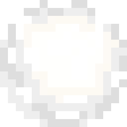
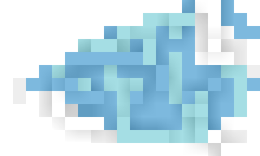
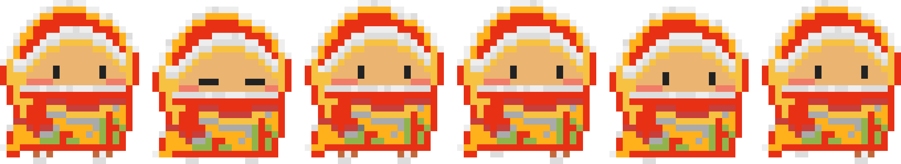
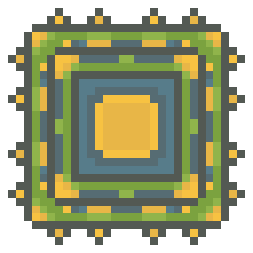
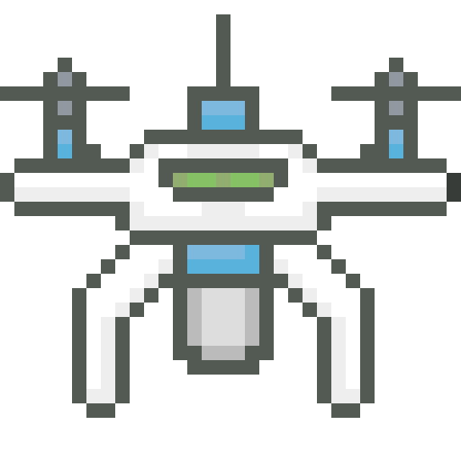

# Sprites
Sprites for portfolio 🎨

## ⛄ WINTER

  

  

## ⚙️ TECHNIQUE

  

 

## 🍔 FOOD

  

### 🛠 Tools
* Design: MagicaVoxel

### 🔒 Copyright
© 2024–2026 **Akbarov Damir**. All rights reserved.

This project and all its visual assets (voxel models, 2D/3D sprites, textures, and renders) were created using MagicaVoxel and are for portfolio demonstration purposes only. Unauthorized copying, modification, or commercial use of these materials without the author's express written permission is strictly prohibited.
