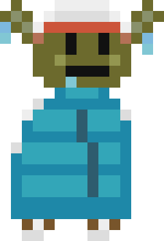
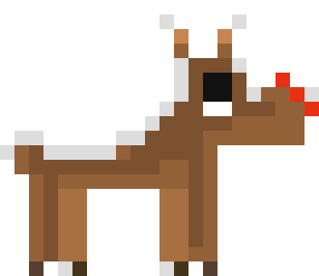
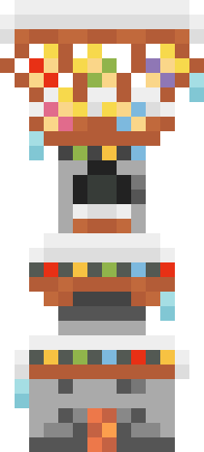
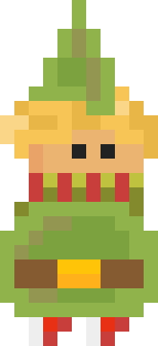
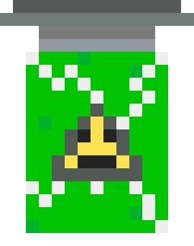
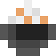
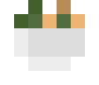
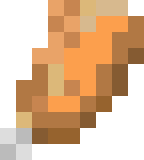

# 🖌️ Pixel Art & Sprites Portfolio
Featured pixel assets designed for game projects. 🎨

  <a href="#english">English</a> • 
  <a href="#chinese">中文</a> • 
  <a href="#russian">Русский</a>

---

## 🇬🇧 Game Art & Pixel Sprites Portfolio
Showcase of pixel art assets developed and integrated into games on the **Unity Engine**.

### ⛄ WINTER
<table>
  <tr>
    <td width="20%"></td>
    <td width="20%"></td>
    <td width="20%"></td>
    <td width="20%"></td>
    <td width="20%"></td>
  </tr>
  <tr>
    <td width="20%"></td>
    <td width="20%"></td>
    <td width="20%"></td>
    <td width="20%"></td>
    <td width="20%"></td>
  </tr>
</table>

### ⚙️ TECHNIQUE
<table>
  <tr>
    <td width="33.3%"></td>
    <td width="33.3%"></td>
    <td width="33.3%"></td>
  </tr>
  <tr>
    <td width="33.3%"></td>
    <td width="33.3%"></td>
    <td width="33.3%"></td>
  </tr>
</table>

### 🍔 FOOD
<table>
  <tr>
    <td width="25%"></td>
    <td width="25%"></td>
    <td width="25%"></td>
    <td width="25%"></td>
  </tr>
  <tr>
    <td width="25%"></td>
    <td width="25%"></td>
    <td width="25%"></td>
    <td width="25%"></td>
  </tr>
</table>

### 🛠️ Tools
* **Design:** MagicaVoxel (2D)

### 🔒 Copyright

© 2024–2026 **Akbarov Damir**. All rights reserved.

All graphic assets and sprites are the intellectual property of the author. Unauthorized copying, modification, or distribution of these resources without prior written permission from the copyright holder is strictly prohibited.

---

## 🇨🇳 游戏美术与像素资源作品集
像素艺术资产展示，均已导入、配置并应用于 **Unity 引擎** 开发的游戏项目中。

### ⛄ 冬季主题 (WINTER)
<table>
  <tr>
    <td width="20%"></td>
    <td width="20%"></td>
    <td width="20%"></td>
    <td width="20%"></td>
    <td width="20%"></td>
  </tr>
  <tr>
    <td width="20%"></td>
    <td width="20%"></td>
    <td width="20%"></td>
    <td width="20%"></td>
    <td width="20%"></td>
  </tr>
</table>

### ⚙️ 科技未来 (TECHNIQUE)
<table>
  <tr>
    <td width="33.3%"></td>
    <td width="33.3%"></td>
    <td width="33.3%"></td>
  </tr>
  <tr>
    <td width="33.3%"></td>
    <td width="33.3%"></td>
    <td width="33.3%"></td>
  </tr>
</table>

### 🍔 美食系列 (FOOD)
<table>
  <tr>
    <td width="25%"></td>
    <td width="25%"></td>
    <td width="25%"></td>
    <td width="25%"></td>
  </tr>
  <tr>
    <td width="25%"></td>
    <td width="25%"></td>
    <td width="25%"></td>
    <td width="25%"></td>
  </tr>
</table>

### 🛠️ 设计软件
* **设计软件:** MagicaVoxel (2D)

### 🔒 版权声明

© 2024–2026 **Akbarov Damir**. 版权所有。

本仓库内的所有图形素材和精灵图（Sprites）均为作者的知识产权。未经版权持有人事先书面许可，严禁擅自复制、修改或传播这些资源。

---

## 🇷🇺 Портфолио игровых пиксельных спрайтов
Демонстрация пиксель-арт ассетов, разработанных и внедренных в игры на движке **Unity**.

### ⛄ ЗИМА
<table>
  <tr>
    <td width="20%"></td>
    <td width="20%"></td>
    <td width="20%"></td>
    <td width="20%"></td>
    <td width="20%"></td>
  </tr>
  <tr>
    <td width="20%"></td>
    <td width="20%"></td>
    <td width="20%"></td>
    <td width="20%"></td>
    <td width="20%"></td>
  </tr>
</table>

### ⚙️ ТЕХНОЛОГИИ
<table>
  <tr>
    <td width="33.3%"></td>
    <td width="33.3%"></td>
    <td width="33.3%"></td>
  </tr>
  <tr>
    <td width="33.3%"></td>
    <td width="33.3%"></td>
    <td width="33.3%"></td>
  </tr>
</table>

### 🍔 ЕДА
<table>
  <tr>
    <td width="25%"></td>
    <td width="25%"></td>
    <td width="25%"></td>
    <td width="25%"></td>
  </tr>
  <tr>
    <td width="25%"></td>
    <td width="25%"></td>
    <td width="25%"></td>
    <td width="25%"></td>
  </tr>
</table>

### 🛠️ Инструменты
* **Дизайн:** MagicaVoxel (2D)

### 🔒 Авторские права

© 2024–2026 **Akbarov Damir**. Все права защищены.

Все графические материалы и спрайты являются интеллектуальной собственностью автора. Копирование, модификация или распространение этих ресурсов без предварительного письменного согласия правообладателя запрещены.

